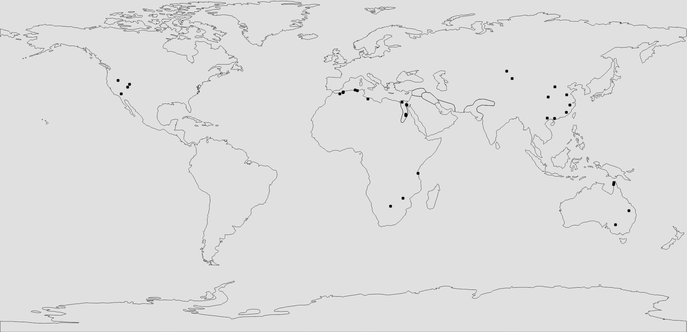

# 1:543 World Map 1.20+


## Download

Download the latest **World Map 1.20+** by clicking the link below:

[Download 1:543 World Map 1.20+](https://cdn.earthmc.org/downloads/earth1-543.zip)

This map is provided as a '.zip' file and is meant for **Minecraft 1.20+**.

## Map Details

- Scale: **1:543**
- Dimensions: **-36864, -18432 to 36864, 15360**
- Ideal for survival, creative, and multiplayer adventures!

## Chunky Border Setup

To set up a border using the **Chunky** plugin, use the following commands:

```
/chunky center 0 0
/chunky corners -36864 -18432 36864 15360
/chunky border add
```

This ensures that the world border is properly defined for an optimal experience.

## Ore Distribution

### Clay Clumps

- Found near rivers, lakes, and ocean shores.
- Primarily located at **Y 50 to Y 64**.

### Coal Ore

- Common in mountains and underground.
- Found between **Y 0 and Y 256**, with peak distribution around **Y 95**.

### Copper Ore

- Mostly found in dripstone caves and underground.
- Generates between **Y -16 and Y 112**, peaking at **Y 48**.

### Diamond Ore

- Found deep underground in all biomes.
- Spawns between **Y -64 and Y 16**, with best yields below **Y -58**.

### Gold Ore

- Common in badlands and deep underground.
- Spawns between **Y -64 and Y 32**, peaking around **Y -16**.
- More abundant in badlands.

### Iron Ore

- Found in caves, mountains, and underground.
- Spawns between **Y -64 and Y 320**, with the highest generation around **Y 16 and Y 232**.

### Netherite (Ancient Debris)

- Found only in the Nether.
- Generates between **Y 8 and Y 22**, with peak concentration at **Y 15**.

### Quartz Ore

- Found exclusively in the Nether.
- Spawns between **Y 10 and Y 117**, most common in large veins.

### Redstone Ore

- Common deep underground.
- Spawns between **Y -64 and Y 16**, peaking at **Y -58**.

## Climate Layout


- Different regions feature unique temperature and biome distributions.
- Expect **cold zones** in the north and **hotter biomes** near the equator.
- Coastal and mountainous areas influence precipitation and vegetation.

## Support

For any questions or support, join our [Discord](https://discord.gg/yFKhYr6ZmQ).
