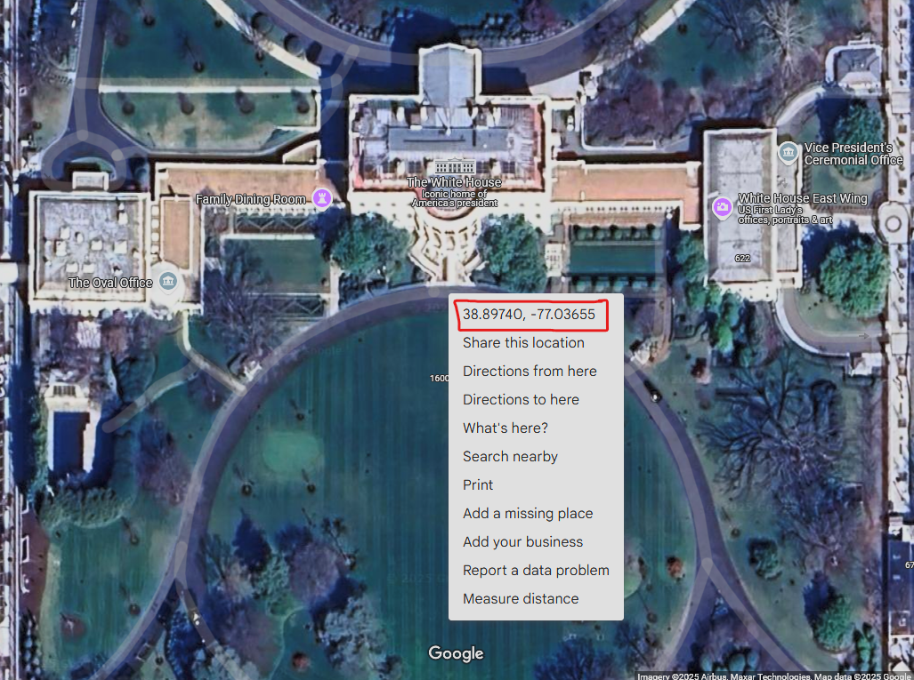

# Coordinator

## [Click Here to Download Plugin](https://github.com/EarthPol/Coordinator/releases)

### Configuration Options
- `scale`: The blocks per Tile
  - `Value Type`: Integer
  - `Default`: 3072
- `tiles`: Degrees per Tile
    - `Value Type`: Integer
    - `Default`: 15
- `mapsLink`: Enables or disables the Google Maps link generated in `/getlocation`
    - `Value Type`: Boolean
    - `Default`: true
- Note: Together, scale + tiles make up the ratio for the size of the map. Make sure you reference your scale and tiles below in the "How to Setup" section


### Permissions
- `coordinator.admin`: grants access to reloading and setting variables.
- `coordinator.teleport`: grants access to teleporting to the generated location while using `/coordinate`

### How to Setup:
1. Setup your plugin by defining the scale and tiles.

| Ratio  | Scale | Tiles |
|--------|-------|-------|
| 1:108  | 15360 | 15    |
| 1:217  | 7680  | 15    |
| 1:326  | 5120  | 15    |
| 1:543  | 3072  | 15    |

2. Start the plugin
3. Use `/getlocation` or `/coordinate` in game

**Pro Tip:** You can easily get decimal coordinates from Google Maps by right clicking a location and clicking the numbers coordinates. Example:


### Commands

- `/getlocation`: Translates Minecraft Coordinates to real life coordinates using the scale and tiles. Also generates a Google Maps link to view the location you are at in your browser if you have `mapsLink` enabled.

- `/coordinate <latitude> <longitude>`: Requires the use of decimal coordinates. After you enter the latitude and longitude, it will generate the coordinates in Minecraft. If you have permission to `coordinate.teleport` it will generate a teleport command you can click to go there.

- `/coordinator` Primary root command for the plugin
- `/coordinator set scale <number>` - Allows you to easily set scale from within the game, this will save to the configuration file.
- `/coordinator set tiles <number>` - Allows you to easily set tiles from within the game, this will also save to the configuration file.
- 
### Calculations:
The java code that makes this run:
- **Minecraft to Coordinate**:
```
lat = -1 * ((z / scale) * tiles);
lng = (x / scale) * tiles;
```

- **Coordinate to Minecraft**:
```
x = (int) Math.round(lng * scale / tiles);
z = (int) (-1 * Math.round(lat * scale / tiles));
```